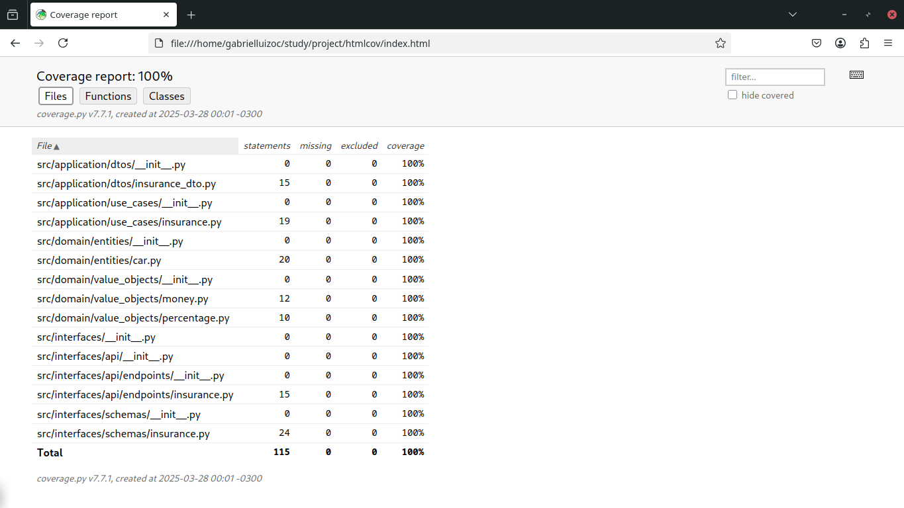
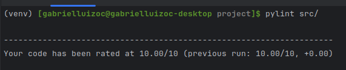

# Insurance Calculation API

## Prerequisites

- Docker Engine (v20.10+)
- Docker Compose (v2.0+)
- Python (used version 3.13.x)
- Pip (used version 24.3.x)

## Project Structure

```
.
├── src
│   ├── application
│   │   ├── dtos
│   │   │   ├── __init__.py
│   │   │   └── insurance_dto.py
│   │   └── use_cases
│   │       ├── __init__.py
│   │       └── insurance.py
│   ├── domain
│   │   ├── entities
│   │   │   ├── car.py
│   │   │   └── __init__.py
│   │   └── value_objects
│   │       ├── __init__.py
│   │       ├── money.py
│   │       └── percentage.py
│   ├── interfaces
│   │   ├── api
│   │   │   ├── endpoints
│   │   │   │   ├── __init__.py
│   │   │   │   └── insurance.py
│   │   │   └── __init__.py
│   │   ├── schemas
│   │   │   ├── __init__.py
│   │   │   └── insurance.py
│   │   └── __init__.py
│   ├── config.py
│   └── main.py
├── tests
│   ├── application
│   │   ├── use_cases
│   │   │   ├── __init__.py
│   │   │   └── test_ensurance.py
│   │   └── __init__.py
│   ├── domain
│   │   ├── entities
│   │   │   ├── __init__.py
│   │   │   └── test_car.py
│   │   ├── value_objects
│   │   │   ├── __init__.py
│   │   │   ├── test_money.py
│   │   │   └── test_percentage.py
│   │   └── __init__.py
│   ├── interfaces
│   │   ├── endpoints
│   │   │   ├── __init__.py
│   │   │   └── test_ensurance.py
│   │   ├── schemas
│   │   │   ├── __init__.py
│   │   │   └── test_ensurance_schemas.py
│   │   └── __init__.py
│   ├── conftest.py
│   └── __init__.py
├── docker-compose.yml
├── Dockerfile
├── env-example.txt
├── README.md
├── requirements.txt
└── story.md
```

## Screenshots



## Quick Start

### 1. Clone the repository (if not already cloned)
```bash
git clone git@github.com:gabrielluizoc/fastapi-project.git
cd fastapi-project
```

### 2. Build and run the application
```bash
docker-compose up --build
```
### 3. Access API Documentation
[Insurance API Docs](http://localhost:/docs)